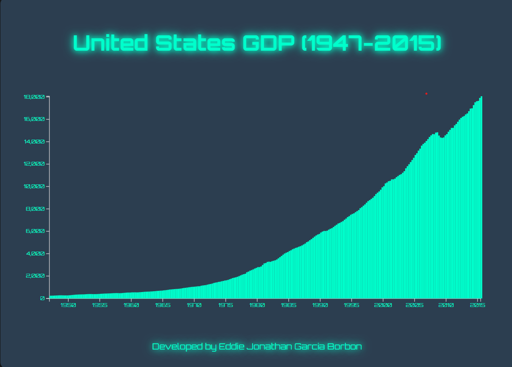

# United States GDP Bar Chart

## Project Screenshot
  

## Project Description
This project is an interactive visualization of the United States Gross Domestic Product (GDP) from 1947 to 2015. It uses the D3.js library to create a bar chart that displays the data in a clear and engaging way. The design is modern and futuristic, with visual effects that enhance the user experience.

## Key Features
- **Interactive Bar Chart:** Displays the U.S. GDP over time.
- **Dynamic Tooltip:** Hover over the bars to see detailed information (date and GDP value).
- **Futuristic Design:** Uses neon colors, shadows, and modern typography for a tech-inspired look.
- **Responsive:** The chart adapts to different screen sizes.
- **Developer Credit:** Includes a footer with the developer's name.

## Technologies Used
- **HTML5:** Project structure.
- **CSS3:** Modern styling and design.
- **JavaScript:** Logic and DOM manipulation.
- **D3.js:** Library for data visualization.
- **Google Fonts:** Modern typography (Orbitron and Roboto).

## How to Use
1. Clone this repository or download the files.
2. Open the `index.html` file in your browser.
3. Interact with the chart:
   - Hover over the bars to see GDP details in the tooltip.

## Project Structure
united-states-gdp-bar-chart/ │ 
├── index.html # Main HTML file 
├── styles.css # CSS styles for the project 
├── script.js # JavaScript logic and D3.js visualization 
├── README.md # Project documentation 
    └── screenshot.png # Project screenshot (optional)

## How to Contribute
If you'd like to contribute to this project, follow these steps:
1. Fork the repository.
2. Create a new branch (`git checkout -b feature/new-feature`).
3. Make your changes and commit them (`git commit -m 'Add new feature'`).
4. Push to the branch (`git push origin feature/new-feature`).
5. Open a Pull Request.

## Credits
- **Developed by:** Eddie Jonathan Garcia Borbon
- **Data:** [freeCodeCamp](https://www.freecodecamp.org/)
- **Inspiration:** Data visualization projects with D3.js.

## License
This project is licensed under the MIT License. For more details, see the LICENSE file.

## Screenshots
- **Tooltip Example:** <!-- Add a screenshot of the tooltip in action -->

## Related Links
- [D3.js Documentation](https://d3js.org/)
- [freeCodeCamp Data Visualization Projects](https://www.freecodecamp.org/learn/data-visualization/)
- [Google Fonts](https://fonts.google.com/)

Thank you for checking out this project! If you have any questions or suggestions, feel free to reach out. 😊

## Additional Notes
- Make sure you have an internet connection to load Google Fonts and the GDP data.
- You can customize the design and colors to suit your preferences.
